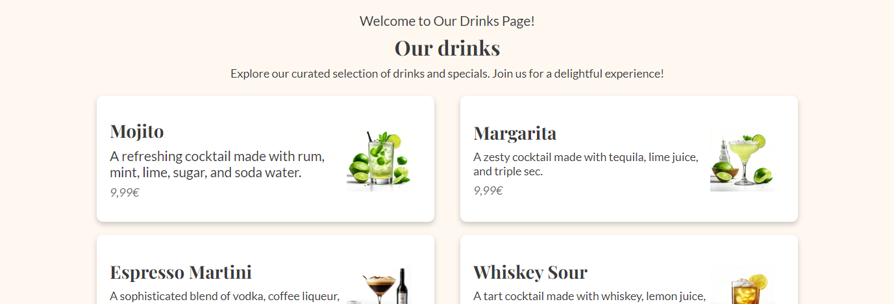
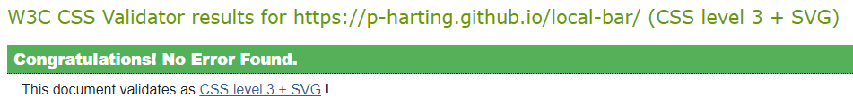

# Local Bar

Local Bar is your one-stop destination for all things local nightlife. Designed to enhance your experience, our website provides a hassle-free platform for exploring your favorite neighborhood bar. Whether you're a regular or a first-time visitor, Local Bar offers an easy-to-navigate homepage, a comprehensive drinks page, an event calendar, and a convenient contact section.

## Contents
* [UX](#ux)
  * [Wireframes](#wireframes)
    * [Landingpage](#landingpage)
    * [Events Page](#events-page)
    * [Drinks Page](#drinks-page)
    * [Contact Page](#contact-page)
  * [Color Palette](#color-palette)
  * [Fonts](#fonts)
* [Features](#features)
  * [Navigation Bar](#navigation-bar)
  * [Footer](#footer)
  * [Landing Page](#landing-page)
    * [Hero](#hero)
    * [Reviews](#reviews)
    * [About Us](#about-us)
    * [Newsletter](#newsletter)
  * [Events Page](#events-page)
    * [Hero With Audio Player](#hero-with-audio-player)
    * [List Of Events](#list-of-events)
  * [Drinks Page](#drinks-page)
  * [Contact Page](#contact-page)
  * [404 Page](#404-page)
* [Responsive Design](#responsive-design)
* [Testing](#testing)
  * [Manual Testing](#manual-testing)
  * [Functional Testing](#functional-testing)
  * [Validator Testing](#validator-testing)
  * [Accessibility Testing](#accessibility-testing)
  * [Bugs](#bugs)
* [Deployment](#deployment)
* [Credits](#credits)
* [Acknowledgments](#acknowledgments)

## UX
Wireframes were meticulously crafted using [Figma](https://www.figma.com/), leveraging its versatile design capabilities and collaborative features.

The color palette was thoughtfully created using [Canva](https://www.canva.com/), ensuring that the chosen colors resonate with the brand identity and evoke the desired ambiance for the Local Bar website.
### Wireframes
Wireframes play a crucial role in the development process, providing a visual guide for the layout and structure of each webpage. They serve as blueprints, outlining the placement of key elements such as navigation bars, content sections, and footer areas.

For the Local Bar website, wireframes were meticulously crafted to ensure an intuitive and user-friendly interface across all devices. Each wireframe represents a unique page, from the captivating landing page to the informative events and drinks pages.
#### Landing page

#### Events Page

#### Drinks Page

#### Contact Page

### Color Palette

For the Local Bar website, a carefully curated color palette has been selected to evoke the ambiance and energy of a neighborhood bar.

- Dark Brown: #402E32
The rich, deep hue of dark brown serves as the main accent color, symbolizing the warmth and inviting atmosphere typical of a local bar. This color choice exudes sophistication and hints at the rich tones found in aged spirits, creating a sense of tradition and authenticity.

- Warm White: #FFF8F1
The background color, warm white, envelops the website with a welcoming glow, reminiscent of soft lighting in a dimly lit bar. This choice creates a comfortable backdrop for content, ensuring readability and allowing other elements to stand out.

- Light Gray: #D3D3D3
Light gray adds a subtle touch of elegance and professionalism to text elements throughout the website. It complements the dark brown accent color while providing contrast against the warm white background, enhancing readability and visual hierarchy.

- Mid Gray: #6D6D6D
Mid-gray is utilized for shadows and subtle design elements, adding depth and dimension to the website's layout. Its neutral tone ensures that shadows blend seamlessly with the overall color scheme, enhancing visual appeal without overpowering other elements.

- Dark Gray: #3A3A3A
As the darkest shade in the palette, dark gray is employed sparingly for text and UI elements where emphasis and contrast are needed. Its deep tone adds a touch of sophistication and sharpness to key components, guiding users' attention and improving usability.

In essence, this color palette reflects the ambiance of a local bar, where patrons can unwind and socialize in a comfortable and inviting environment.

### Fonts
For this project, I've incorporated Playfair Display and Lato fonts sourced from Google Fonts. The font sizes are dynamically adjusted for responsive design.
- Playfair Display is employed for the page logo and headings.
- Lato is utilized for the menu and body text.

## Project Rationale
Local Bar, the establishment, inspired the development of this project to provide patrons and potential visitors with easy access to essential information about the venue and its offerings. The key project goals and target audience include:

### Key Project Goals:
- **Enhancing Visitor Experience:** The primary objective is to create a digital platform that mirrors the welcoming ambiance and convenience of the physical bar, offering patrons an engaging and informative online experience.
- **Promoting Local Business:** By showcasing the unique atmosphere, events, and drinks available at Local Bar, the project aims to support the local economy and foster community engagement.
- **Accessibility:** It's imperative to ensure that the website is accessible to all users, including those with disabilities, by implementing responsive design and adhering to web accessibility standards.

### Target Audience:
The target audience for the Local Bar website comprises:
- **Regular Patrons:** Individuals who frequent Local Bar and want quick access to information about upcoming events, drink specials, and other updates.
- **Potential Visitors:** Those who are considering visiting Local Bar for the first time and want to learn more about what the establishment has to offer.
- **Local Community Members:** Residents of the neighborhood interested in supporting local businesses and staying informed about community events and initiatives.

By catering to the needs of these groups, the Local Bar website aims to serve as a valuable resource for both loyal patrons and newcomers alike, fostering a sense of community and belonging.

## Features
### Navigation Bar

- Included on all pages, the responsive navigation bar includes links to the Homepage, Drinks, Events, and Contact page and is identical on each page
- This feature will enable the user to effortlessly move between pages on any device

### Footer

- The footer is streamlined and adapts to mobile screens, featuring online social links and a logo. On the desktop, it mirrors the navigation bar and offers a range of legal links.

### Landing page
The layout and design of the landing page are optimized for both desktop and mobile devices, ensuring a seamless user experience across all platforms.
#### Hero

- The landing page features a hero section with a captivating headline, a compelling call-to-action button, and an eye-catching background image that sets the tone for the user experience.
#### Reviews

- Below the hero section, customer reviews are prominently displayed, providing social proof and building trust with potential customers.
#### About Us

- An about us section provides a brief overview of the company, its mission, and its values, helping to establish a connection with the user.
#### Newsletter

- A newsletter signup form provides a quick way to opt in to stay up to date about discounts and events.

### Events Page
#### Hero With Audio Player

- Users can enjoy a dynamic experience with an integrated audio player on the Events page, enhancing the atmosphere and providing a preview of the music selection for each event.
#### List Of Events

- The events page showcases upcoming events at Local Bar, providing details such as event dates, titles, and descriptions.

### Drinks Page

- The drinks page showcases a variety of beverages available at Local Bar, with descriptions, pricing, and images generated using SDXL from Stability AI, offering users an enticing preview of the offerings.

### Contact Page

- The Contact page provides users with a convenient form to reach out to Local Bar for inquiries, reservations, or feedback. Submissions are directed to a dedicated result page for further processing.

### 404 Page

- A custom 404 error page provides users with a friendly and informative message in case they encounter a broken link or unavailable page during their browsing experience.

## Responsive Design
- All images on the website are optimized to ensure fast loading times across various devices and screen sizes.
- Flexbox layout is extensively utilized throughout the website, allowing for dynamic arrangement of elements and optimal use of available space.
- Text size and spacing are calculated responsively, adjusting based on the screen size and resolution to ensure readability and visual appeal.
- Media queries are strategically implemented to adapt the layout and design elements for different screen sizes, guaranteeing a consistent and user-friendly experience across desktops, tablets, and mobile devices.

## Testing
### Manual Testing
For a thorough evaluation of the website's functionality, I conducted a series of manual tests across various platforms and devices. 

- **Desktop Testing:** Verified compatibility using Chrome, Firefox, and Edge browsers on a Windows computer.
- **Mobile Testing (Android):** Ensured responsiveness and functionality with Chrome and Firefox browsers on an Android device.
- **Mobile Testing (iOS):** Tested compatibility and performance using Safari on an iOS device.
- **User Feedback:** Solicited input from multiple users to assess website functionality across different devices and gather valuable feedback on user experience.
- **Link Verification:** Manually inspected all internal and external links to ensure they direct users accurately.
- **Contact Form Validation:** Confirmed that the contact form functions as intended, requiring valid inputs for submission.

These rigorous tests ensure a seamless user experience across various platforms and devices.

### Functional Testing
| Action                                                                                         | Expected Behavior                                                                                            | Passed or Failed |
|------------------------------------------------------------------------------------------------|--------------------------------------------------------------------------------------------------------------|------------------|
| Click on the "Home" link in the navigation                                                     | The homepage should load                                                                                    | Passed           |
| Click on the "Drinks" link in the navigation                                                   | The drinks page should load                                                                                 | Passed           |
| Click on the "Events" link in the navigation                                                   | The events page should load                                                                                 | Passed           |
| Click on the "Contact Us" link in the navigation                                               | The contact page should load                                                                                | Passed           |
| Fill out the contact form with invalid inputs                                                   | Error messages should be displayed indicating invalid input                                                   | Passed           |
| Fill out the contact form with valid inputs and submit it                                       | A confirmation page should be displayed indicating successful submission                                    | Passed           |
| Verify that all content is displayed correctly on each page                                     | All content should be displayed properly                                                                     | Passed           |
| Click on the social media links in the footer                                                   | The respective social media pages should open in a new tab                                                  | Passed           |
| Play the audio player on the events page                                                        | The audio file should play                                                                                   | Passed           |
| Pause the audio player                                                                          | The audio playback should pause                                                                               | Passed           |
| Enter a valid email address in the newsletter form                                             | No error message should be displayed                                                                        | Passed           |
| Enter an invalid email address in the newsletter form                                           | An error message should be displayed indicating invalid email address                                       | Passed           |

### Validator Testing
#### HTML

- No errors were detected on any page through the W3C HTML Validator.
#### CSS

- The W3C CSS Validator found no errors in the stylesheet.
#### Lighthouse

- After using the Chrome Lighthouse tool, I obtained good scores across performance, accessibility, best practices, and SEO.

### Accessibility Testing
To ensure optimal accessibility for all users, extensive color contrast testing was conducted using the [Coolors Contrast Checker](https://coolors.co/). The following images illustrate the results of the color contrast tests:

These tests aimed to verify that text elements across the website maintain sufficient contrast against their respective backgrounds, thus ensuring readability and usability for individuals with visual impairments.
### Bugs
- [✔] Mobile footer is too big because of the hidden right side
- [✔] White line between navigation and main because of the wrong margin
- [✔] Mobile menu not opening because of an open paragraph in index.html

## Deployment
This section should describe the process you went through to deploy the project to a hosting platform (e.g. GitHub) 

- The site was deployed to GitHub pages. The steps to deploy are as follows: 
  - In the GitHub repository, navigate to the Settings tab 
  - From the source section drop-down menu, select the Master Branch
  - Once the master branch has been selected, the page will be automatically refreshed with a detailed ribbon display to indicate the successful deployment. 

The live link can be found here: https://p-harting.github.io/local-bar/

## Credits
- Instructions on how to implement a responsive navigation bar were adapted from tutorials by Love Running.
- The design for the `
` element was inspired by [CSSTricks](https://css-tricks.com/examples/hrs/).
- Icons used throughout the website were sourced from [Font Awesome](https://fontawesome.com/).
- All fonts utilized in the project were obtained from [Google Fonts](https://fonts.google.com/).
- Techniques for overlaying images with color were implemented based on advice found on [Stack Overflow](https://stackoverflow.com/questions/9182978/semi-transparent-color-layer-over-background-image).
- Responsiveness using child elements was achieved with reference to the documentation on [MDN Web Docs](https://developer.mozilla.org/en-US/docs/Web/CSS/:nth-last-child).
- Implementation of positioning elements was guided by documentation on [MDN Web Docs](https://developer.mozilla.org/en-US/docs/Web/CSS/position).
- Images of drinks were generated using SDXL from [Stability AI](https://stability.ai/stable-image).
- Responsive font size calculations were inspired by techniques outlined by Matthew James Taylor on [his website](https://matthewjamestaylor.com/responsive-font-size).
- Root colors were defined with reference to information provided by [W3Schools](https://www.w3schools.com/css/css3_variables.asp).
- An audio player was integrated into the website using HTML `<audio>` elements, with guidance from the documentation on [MDN Web Docs](https://developer.mozilla.org/en-US/docs/Web/HTML/Element/audio).
- Background music for the website was sourced from [FreePD](https://freepd.com/upbeat.php), specifically the track "Bar Brawl".
- A custom 404 error page was created following the instructions provided by [GitHub](https://docs.github.com/en/pages/getting-started-with-github-pages/creating-a-custom-404-page-for-your-github-pages-site).

## Acknowledgments
I would like to express my gratitude to my mentor, Dick Vlaanderen, whose guidance and support have been invaluable throughout the development of these projects. Your expertise and encouragement have greatly contributed to my growth as a developer.

I also want to extend my appreciation to Kristyna Wach, our Cohort Facilitator, for her continuous assistance and dedication to fostering a collaborative learning environment. Your insights and feedback have been instrumental in shaping my learning journey.